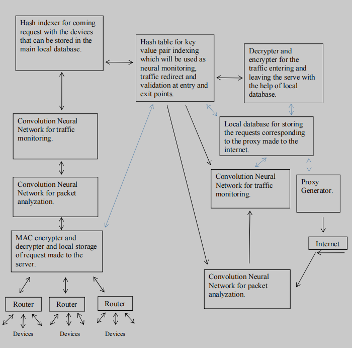

# NATRAJ - A localized End to End encrypted server with Neural Networks to act as a packet filtering firewall and accessing the internet using proxy for actual device ID masking.

# Piyush Mishra

# Department of Computer Science and Engineering, Institute of Engineering and Technology,  Bundelkhand University,  Jhansi

 [https://orcid.org/0000-0001-9775-1596](https://orcid.org/0000-0001-9775-1596) 

[pnoop786@gmail.com](pnoop786@gmail.com)

[piyushmishra.professional@gmail.com](piyushmishra.professional@gmail.com)

# Abstract
In the modern times where cyber - attacks are increasing at an alarming rate. The key components of the internet that is the traffic needs to be secured. The internet traffic flows in the form of packets which travel from one destination to the other. The major cyber - attacks target these packets to compromise device and network security. The paper proposes a fortified technique of internet providing to any enterprise, organization or individual by providing a local server NATRAJ to which every device can make requests to and the requests are handled by NATRAJ in such a manner that the internal security of the network stays ensured. At last these requests can communicate with the outer network and NATRAJ acts like a firewall. The proposed idea according to the paper points towards assigning a unique hash value to every device, router and their respective send and get request made to the server. This hash table can be put into use to properly deliver the packets inside the internal networks and can be ensured secured against any internal network breaches. The hash provided requests can be processed through our neural network to check for malicious requests send or received as the other neural network can monitor the directed traffic. Both of the neural network systems can act like a two factor authentication system to cross verify the packets and the address to which they will be delivered and the entire system will act like a two factor authentication firewall for the internal network which will in last communicate with the outer network or internet.

# Index Terms
End to End encryption, Encrypted traffic classification, end to end, one dimensional convolution neural networks, IP hashing, proxy masking of the IP.

# I.Introduction
The paper introduces a new hybrid approach to set up a local server to which every device inside a network can make request instead of individually making request to the internet which waits for major cyber threats that can be possessed to the devices. The approach is to integrate every old school technique of network security into one and making a firewall that can protect the internal as well as external intrusion. The approach is a setup up to rest ensure the security by integration of various techniques to ensure internet traffic safety delivered to the network. The set up provides us with the use of end to end internal network that can be used to link the devices to each other with the use of the hash tables that can be feeded with unique device id for every device and router connected to the network. The hash table can be used to deliver packets to the devices associated with their requests made to the server and the traffic can then be transferred to the internet using a convolution based neural network. The sets of neural network will help to analyze the traffic by identifying the traffic flow and the other neural network will help to analyze the packets. The idea is to build a local server that act as a service request provider and receiver for the internet as well as act as a firewall for the complete network. The hash tables act as an extra layer of safety for the devices as the network cannot be polluted from inside for example the cases of unauthenticated use of the Wi-Fi router. 
The major components of  NATRAJ can be classified as follows:-

* Hash table with every device id, router id, send requests and get requests stored in the form of hashes to provide an end to end internal encryption and distribution using key value pairs.

* Two sets of hybrid Neural Networks model [3] [4] [5] [7] [8] at both entry and exit points one for packet filtering and another for traffic flow analyzation for checking and cross validation of the traffic entering or leaving NATRAJ.

<p float="left">
  
</p>

Table 1. Representation of the stored values in local database for authentication purpose

```
if(DID == ReID)
{
else if(did == ReID)
{
else if (ReID == SeID)
{
connection successful
{
break
```

So this is an overview for the hash table that can be used to store the generated hashed IP addresses and packets moving in traffic inside the network. The hashed addresses like the device id and router id acts like the first line of defence to rest ensure that the authorized devices gets access to the internet using the NATRAJ server and the hashed addresses stop any form of internal intrusion if possible as the devices information is secured using the hash values and values cannot be manipulated.

 Findings and Solutions

The protocol presented in the paper targets the flow of the traffic through a constraint route that is our NATRAJ server and every device connected to a network make requests to the NATRAJ server and our server will make requests to the Internet by using proxy In a way the protocol prevents the devices from directly accessing the Internet where it is wide open to several kinds of attacks. The server acts like a firewall and a proxy address for each and every device connected to NATRAJ. The storing of device’s MAC address locally in our databases (M) in encrypted form, then checking the locally stored values at the time of device connection to the router or before making request to the server acts like the first line of defense as it removes any unauthorized access from making requests to NATRAJ. Devices connected to the same network would be prevented from revealing their identity to the network in order to prevent any attacker from internally infecting the network. Hashing of every request with their respective address i.e. the device id and router id helps in forming a ledger that could be used to cross validate the request made and information received to the corresponding requests. Analyzing these ledgers with the help of neural networks help to monitor and analyze that the requests made to the server and received from the internet don’t follow any sort of redirects or leaks that lead to data breaches or unethical spying of the devices.
Encryption techniques are not presented in the paper as it is left on the organization side which particular form of encryption technique to use when the set up is actually put into use. The general idea behind encryption is to map every device corresponding to their send and get request made to the server and transferred to the internet and cross map for validating and redirecting the request received from the internet to the respective devices connected to NATRAJ. The entire set up can play an effective role to encrypt the traffic and put a cross validation technique at every step made by the traffic leaving or entering NATRAJ, delivered or received by the devices making request to NATRAJ.
The pair of Neural Networks checks for the traffic and packets in parallel on the both entry and exit points of the server to cross check address and requests ledger if the traffic and packets are redirected to meant destinations and not eavesdropped by any sort of un-ethical activities and if found can be terminated.
The exit points are ensured with proxy generator to mask the IP addresses by which the request is leaving the server and every IP and request are stored in local database (D3) dynamically which gets replaced when the server gets a response from the internet. In this manner every request that leaves the server and every traffic received by the server can be can be cross validated and encrypted - decrypted to follow an internal end to end communication protocol, leaving the attackers helpless and clueless about the actual address or requests made by the devices to the internet. So in this manner every device is making the request to the server and internet in last don’t reveal their actual sensitive information like which sort of device is used for making the requests, making any kind of attack really difficult to take place as the entire server and devices connected to server are making it really difficult to find the devices connected inside the network masked under the hashed values stored inside ledgers making it impossible to manipulate.

<p float="left">
  
</p>

Diagram and overview of NATRAJ 


The set-up of neural network based for packet monitoring and filtering can be based upon the [3] [4] [5] [7] [8] and further enhancements using different models as required as the increasing attacks may differ from time to time.

A - MAC encrypter and decrypter for validating devices using the locally stored MAC address in (M) main database in the form of hash values.

N1 - The  neural network for validating the requests made to the server for any sort of malicious activity.

N2 - The  neural network for validating the traffic and destination address made to the server.

D1 - Hash indexer for encryption of the traffic corresponding to the device ID, router ID, send request and get request which can be stored in the main hash table.

M - Main database which will be used to store every device ID and router ID with their corresponding send and get request corresponding to their proxy address used for traffic communication to the internet. The main database plays an important role in traffic redirect as it stores every value in hash form in order that if anyone gets access to the database then also the corruption of the traffic and routes would be impossible to commit. The database can be used to for redirection of every bits of traffic coming or leaving the NATRAJ.

D2 - The encrypter and decrypter for traffic leaving or entering the NATRAJ which can be used for end to end communication inside NATRAJ leaving the eavesdrop attacks null and void. D2 will play an efficient role as the traffic leaving the NATRAJ cannot be left in its encrypted form to communicate with internet in its original form and traffic entering the NATRAJ needs to be encrypted so as it can be maintained in our database for further information redirects inside our server.

N1 - The neural network for validating the requests made to the server for any sort of malicious activity.

N2 - The neural network for validating the traffic and destination address made to the server.

P - Proxy generator plays an important role in the entire setup as the un - encrypted traffic leaving the server needs to be masked and make it impossible to get the actual device location inside the network in case an eavesdrop attack takes place out of NATRAJ then the it creates a great difficulty for an attacker as internal end to end communication inside the server hides every device address in the form of hashes and the outflow of the traffic is masked. The send back for the corresponding request reaches the device only after the request is verified by our neural networks set up, encrypted and redirected to the corresponding devices with help of D3 and Main database (M).


Table 2. Representation of the mapping of the Proxy IP mapped with send and get request


Finally the proxy IP address used to make request can be mapped with the associated request made from the devices to NATRAJ for redirecting the coming traffic to NATRAJ.


Benefits

The entire set up prevents the devices with any sort of redirection that could be possible to create any possible attack. The set up of Neural Networks will help to monitor the traffic outflow from the devices and ensure to cut any sort of sypware activities that could be possible in case any infected device connects to the network. The storing of hash valued IP addresses and information leaving or entering NATRAJ help in cross validation of information send or received by the devices connected to the network.

Future use cases

As the increase in cyber criminal activities tend to grow in the fore-coming future and the devices connected to the network NATRAJ servers could be used to provide a proxy cum active neural packet filtering firewall to monitor the inflow and outflow of the traffic from any sort device which is using the internet and provide a remote service at a nominal fee. In this way NATRAJ could be used to secure the communication and networks for an organization as well as individual cyber security. 


Conclusion
In general NATRAJ is a set up consisting of packet filtering firewall with active neural network intrusion detection cross validated with the help of various data sets and hash ledger created by the NATRAJ itself consisting of addresses like device ID, router ID, send requests, get requests and proxy used in the last before accessing the internet. This way any device accessing the internet using NATRAJ via any organization or individual remote access can be rest ensured against malicious activities.
Every device connected to NATRAJ is using an end to end protocol to communicate to the server and using a ledger system to store every device and request in the form of hash values which at last are used for monitoring the traffic for any sort of redirect or malicious activities. The entire NATRAJ set up cross validates that the devices connected to NATRAJ don’t leave any sensitive information wide open even to the NATRAJ and other devices using the server. Hashing of every device and request made and stored for cross validation might seem like a tedious and extra effort but helps to create a ledger data sets which can be used by our neural networks to monitor and reject any sort of malicious activities. Proxy for communication purposes used by NATRAJ can be put into use as the request and devices don’t leave their identity open to the internet and in case the traffic needs to monitored by any sort of authorities then the entire NATRAJ needs to be monitored for any illicit activity and if found can be tracked with permission by accessing the ledger of the NATRAJ used by any organization. In this manner NATRAJ don’t break any protocol by hiding the information sent or received to the internet but prevents it from any unauthorized access. As monitoring entire traffic used by organization don’t leave any device connected to the NATRAJ wide open to be targeted individually but if misconducts takes place and any authority want investigation then only authorized can access the ledger by having proper authorization leaving the rest unethical attackers helpless.

The NATRAJ server basically works on the principle of packet filtering firewall with neural networks to actively monitor our traffic and information send or received by the internet. This adds three layers of security to the following networks:-
1.The traffic passed or send by the devices using NATRAJ server are always analyzed in such a manner that every bit of information is analyzed for malicious activities.
2.The hashing of requests associated to the device addresses ensures that the internal security of the networks are ensured.
3.Proxy at the gateway ensures that the traffic leaving NATRAJ never reveals the device information or address inside NATRAJ and using proxy in such manner to access the internet don’t break any protocol as the request are made using an internal ledger which can  be cross validated if demanded.


Acknowledgments
Not belonging to any cyber security or networking domain faced several instances which led to personal findings and the idea originated to form the protocol which is totally based upon compiling the ideas collected from several papers and integrating them into one to form an individual protocol which could be used to act like a line of defence in safeguarding any organization’s or individual’s cyber-space security and would always thank every teacher of mine in order to learn what I can. The protocol doesn’t guarantee security from any sort of attack possible but the idea is to write a procedure which could be followed in order to safeguard as situation demands it.


References

[1] IP Packet Filtering using Hash Table for Dedicated Real Time IP Filter - I.J. Wireless and Microwave Technologies, 2017, 1, 24-29  Published Online January 2017 in MECS(http://www.mecs-press.net) 
DOI: 10.5815/ijwmt.2017.01.03

[2] IP Address Space Management using Aggregated Fixed Length Subnet Masking 

[3] End-to-end Encrypted Traffic Classification with One-dimensional Convolution Neural Networks 

[4] Intrusion Detection Using Neural Networks and Support Vector Machines 

[5] Protocol-Based Deep Intrusion Detection for DoS and DDoS Attacks Using UNSW-NB15 and Bot-IoT Data-Sets - Digital Object Identifier 10.1109/ACCESS.2021.3137201 

[6]IOSR Journal of Computer Engineering (IOSR-JCE) e-ISSN: 2278-0661,p-ISSN: 2278-8727, Volume 16, Issue 6, Ver. V (Nov – Dec. 2014), PP 20-24   www.iosrjournals.org  www.iosrjournals.org The Design and Implementation of On-Line Examination Using Firewall security 

[7]Applying Convolution Neural Network for Network Intrusion Detection

[8]  IJCSNS International Journal of Computer Science and Network Security, VOL.7 No.12, December 2007 
NETWORK INTRUSION DETECTION USING NAÏVE BAYES 


